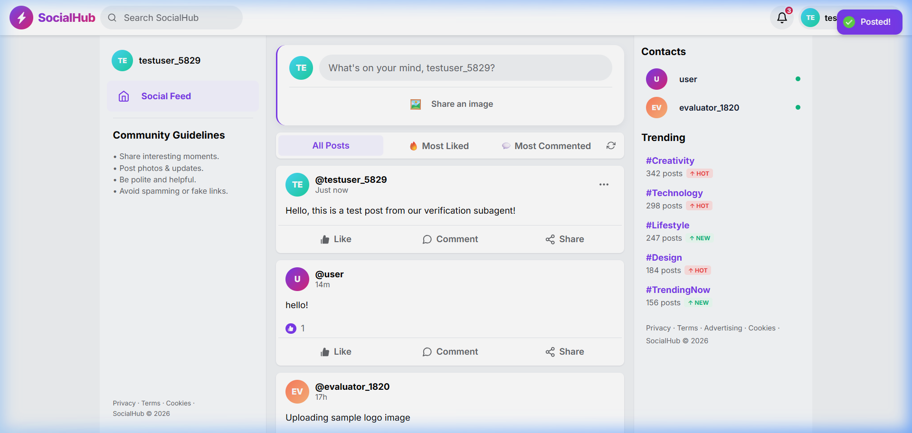
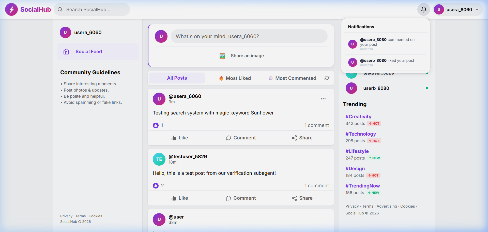

# SocialHub

## Description

SocialHub is a full-stack, responsive mini social media application built with a modern React.js (Vite) client, Node.js (Express) backend API, and a MongoDB database. 

- **What was your motivation?**
  Our motivation was to build a modern, high-performance social media feed inspired by commercial networking applications. We wanted to design a clean, responsive 3-column layout using vanilla CSS and React-Bootstrap to highlight design skills without relying on TailwindCSS utility libraries.
- **Why did you build this project?**
  This project was built to master the integration of Single Page Applications (SPAs) with secure backend APIs, database indexing, and user interaction hooks. It represents a hands-on implementation of cursor-based pagination, preflight CORS security, token validation on mount, and URL-bound state management.
- **What problem does it solve?**
  SocialHub solves the problem of high-latency social updates. It implements instant like and comment state syncing on the client side, a direct header search engine that updates query parameters for shareable search states (`?search=query`), and a lightweight notification system that records user interactions inside subdocument arrays (adhering to a strict two-collection limit).
- **What did you learn?**
  We learned how to design efficient MongoDB aggregation pipelines for paginated sorting, how to write fallback route rewrites for client routing (on Vercel), how to build automatic URL path normalization for APIs, and how to safely hook event triggers to update embedded schemas.

---

## Table of Contents

- [Deployment Links](#deployment-links)
- [Installation](#installation)
- [Usage](#usage)
- [Credits](#credits)
- [License](#license)
- [Features](#features)
- [Tests](#tests)

---

## Deployment Links

The application is deployed live in production:
- **Frontend Client (Vercel)**: [https://socialhub-pied-mu.vercel.app](https://socialhub-pied-mu.vercel.app)
- **Backend Server API (Render)**: [https://socialhub-8x81.onrender.com](https://socialhub-8x81.onrender.com)
- **API Health Endpoint**: [https://socialhub-8x81.onrender.com/api/health](https://socialhub-8x81.onrender.com/api/health)

---

## Installation

To run this project locally, follow these steps:

### 1. Backend Service Configuration
Navigate to the `backend` folder and install dependencies:
```bash
cd backend
npm install
```
Create a `.env` file in the `backend/` root directory and add the following:
```env
PORT=5000
MONGODB_URI=your_mongodb_atlas_connection_string
JWT_SECRET=your_jwt_signing_key
JWT_EXPIRES_IN=7d
NODE_ENV=development
FRONTEND_URL=http://localhost:5173
```
Launch the development server:
```bash
npm run dev
```

### 2. Frontend Client Configuration
Navigate to the `frontend` folder and install dependencies:
```bash
cd ../frontend
npm install
```
Create a `.env` file in the `frontend/` root directory:
```env
VITE_API_URL=http://localhost:5000/api
VITE_APP_NAME=SocialHub
```
Launch the Vite client:
```bash
npm run dev
```
Open `http://localhost:5173` in your browser.

---

## Usage

Users can browse public posts on the main feed page, search for posts using the search bar, register new accounts, publish text and image posts, like posts, comment on posts, and receive live notifications.

### Public Feed Layout
Below is the post feed displaying likes and comments, complete with responsive sidebars for guidelines and contacts:



### User Notifications
When other users like or comment on your posts, you will instantly receive notification badges on the navbar bell icon, displaying the interaction details when clicked:



---

## Credits

### Collaborators
- **Harini Prithiyangara** - [GitHub Profile](https://github.com/HariniPrithiyangara)

### Third-Party Assets
- Icons provided by [React Icons](https://react-icons.github.io/react-icons/) (specifically `react-icons/fi`, `react-icons/fc`, and `react-icons/bs`).
- Global notification alerts powered by [React Hot Toast](https://react-hot-toast.com/).
- Routing handled by [React Router Dom v6](https://reactrouter.com/).
- Server middleware: [Multer](https://github.com/expressjs/multer) for image processing, [Cors](https://github.com/expressjs/cors), [Helmet](https://helmetjs.github.io/), and [Morgan](https://github.com/expressjs/morgan).

---

## License

This project is licensed under the **MIT License** — see the details below:

```
MIT License

Copyright (c) 2026 Harini Prithiyangara

Permission is hereby granted, free of charge, to any person obtaining a copy
of this software and associated documentation files (the "Software"), to deal
in the Software without restriction, including without limitation the rights
to use, copy, modify, merge, publish, distribute, sublicense, and/or sell
copies of the Software, and to permit persons to whom the Software is
furnished to do so, subject to the following conditions:

The above copyright notice and this permission notice shall be included in all
copies or substantial portions of the Software.

THE SOFTWARE IS PROVIDED "AS IS", WITHOUT WARRANTY OF ANY KIND, EXPRESS OR
IMPLIED, INCLUDING BUT NOT LIMITED TO THE WARRANTIES OF MERCHANTABILITY,
FITNESS FOR A PARTICULAR PURPOSE AND NONINFRINGEMENT. IN NO EVENT SHALL THE
AUTHORS OR COPYRIGHT HOLDERS BE LIABLE FOR ANY CLAIM, DAMAGES OR OTHER
LIABILITY, WHETHER IN AN ACTION OF CONTRACT, TORT OR OTHERWISE, ARISING FROM,
OUT OF OR IN CONNECTION WITH THE SOFTWARE OR THE USE OR OTHER DEALINGS IN THE
SOFTWARE.
```

---

## Features

- **🔐 Token Authentication**: User login and registration using securely encrypted passwords (bcryptjs) and JWT validation.
- **🔍 Query-Bound Search**: Real-time filtering of feed posts using URL search query parameters.
- **🔔 Live Notifications**: An embedded user subdocument notification tracking system for likes and comments.
- **🖼️ Image Uploads**: Handles image file validation (maximum 5MB, JPG/PNG/WEBP/GIF only) via Multer disk storage.
- **📑 Cursor Pagination**: Feed fetches posts dynamically in groups of 10.
- **📱 Responsive Flex Grid**: Premium design tailored for desktop, tablet, and mobile browsers.

---

## Tests

To verify the app locally, run the following tests:
- **Backend Connection Test**: Verify the API server health by visiting `http://localhost:5000/api/health`.
- **Axios API Integration Check**: Confirm request headers include the `Bearer <token>` payload inside the request inspector.
- **Client Route Fallback Check**: Refresh your browser at `http://localhost:5173/auth` to confirm that the app successfully loads without returning a 404.
